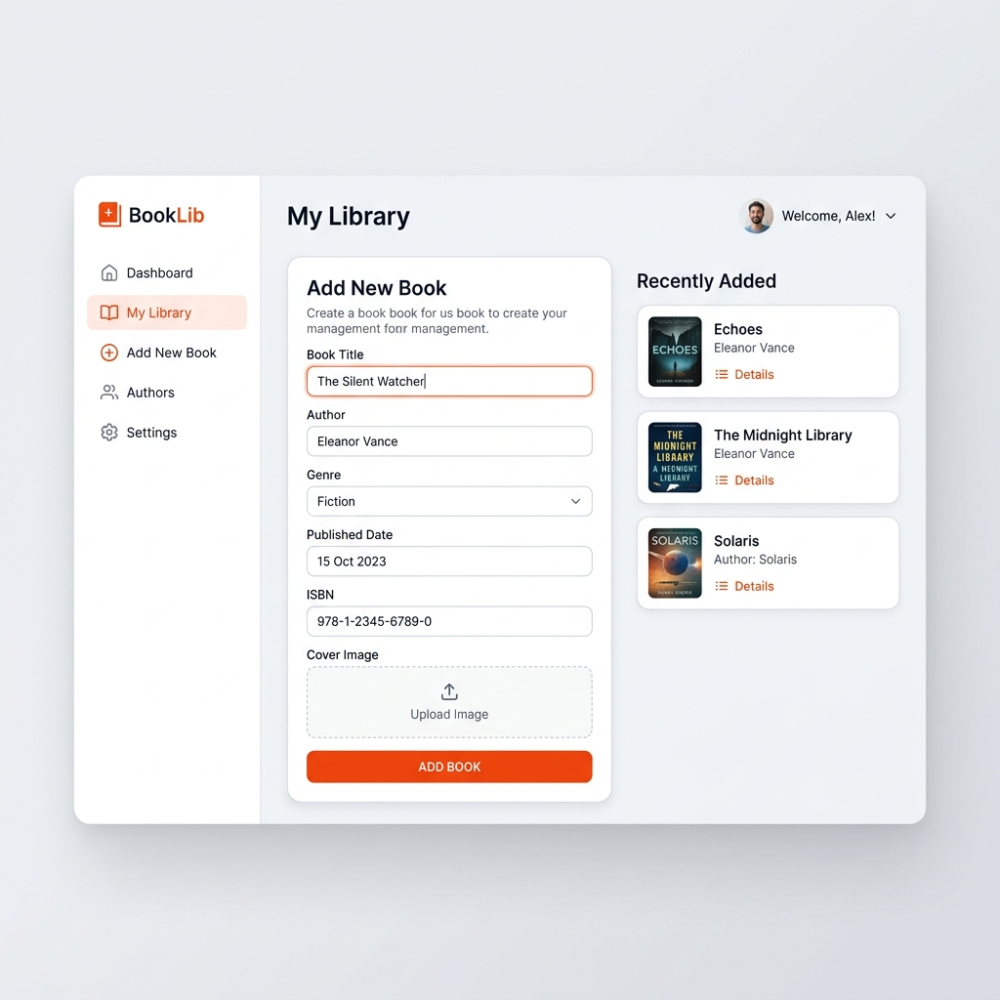
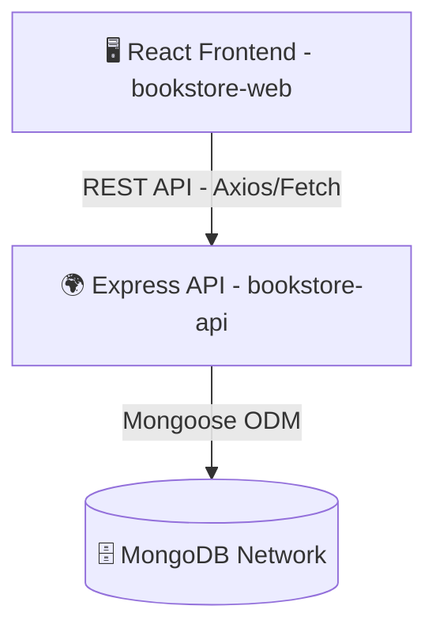

<div align="center">
  
  <h1>✨ Book Management System ✨</h1>
  <p>A full-stack, modular bookstore inventory application built with React, Vite, Node.js, and MongoDB.</p>

  <!-- Badges -->
  <p>
    
    
    
    
    
  </p>
</div>

---

## 🌟 Overview

Welcome to the **Book Management System**. This repository contains a production-ready approach to handling store inventory and book metadata. Separated cleanly into a high-octane React client (`bookstore-web`) and a robust Express RESTful API (`bookstore-api`), this platform empowers administrators to seamlessly catalog and track books.

## 🚀 Key Features

* **Decoupled Architecture:** Frontend and Backend act as separate entities, ensuring isolated scalability.
* **Modern UI:** Built on top of React 19 and Vite for a lightning-fast development experience and optimized output.
* **RESTful Endpoints:** Comprehensive CRUD API (Create, Read, Update, Delete) routed via Express.js.
* **Persistent Data Layer:** Secured and reliable schema-enforced data handling with Mongoose and MongoDB.
* **Clean Theming:** Light, sleek CSS styling utilizing vibrant orange and accessible gray palettes.

---

## 🛠️ Technology Stack

### Frontend Client (`bookstore-web/`)
* **Core:** React 19 (via Vite)
* **Routing:** React Router v7
* **Styling:** Custom CSS with structured component variables

### Backend API (`bookstore-api/`)
* **Server Framework:** Node.js + Express
* **Database Driver:** Mongoose (MongoDB ODM)
* **API Utilities:** CORS enabled, structured environment configurations

---

## 🏗️ System Architecture



---

## 🚦 Getting Started

### Prerequisites
* [Node.js](https://nodejs.org/)
* Access to a running MongoDB instance or a MongoDB Atlas URI

### 1️⃣ Setting up the Backend
```bash
# Navigate to the backend folder
cd bookstore-api

# Install dependencies
npm install

# Setup your local environment variables (.env) and start the server
npm run dev
```

### 2️⃣ Setting up the Frontend
```bash
# Open a new terminal instance and navigate to the frontend folder
cd bookstore-web

# Install dependencies
npm install

# Launch the Vite development server
npm run dev
```
> The web application will be accessible at typically `http://localhost:5173`.

---

<div align="center">
  <b>Engineered with ❤️ for seamless data tracking and system design.</b>
</div>